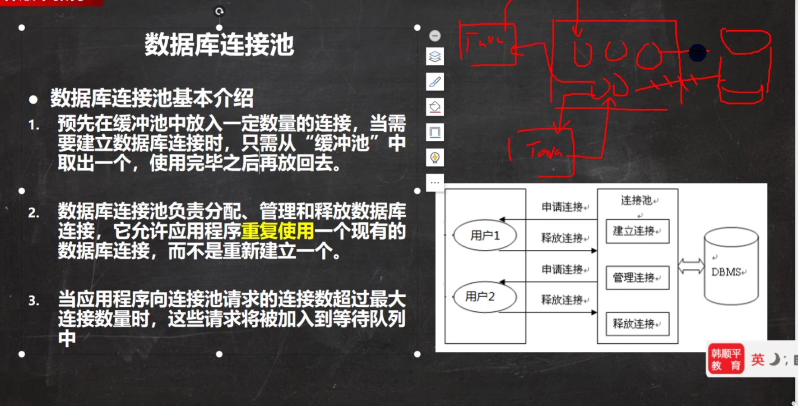

# JDBC


## 获取数据库连接方式


## resultset


## statement


## 预处理


## JDBC API


### DriverManager

```text

2.获取连接
static Connection
getconnection(string url,string user,string password)
参数
1.url:连接路径
语法：jdbc:mysql://ip地址（域名）端口号/数据库名称?参数键值对1&参数键值对2.
示例：jdbc:mysql://127.0.0.1:3306/db1

细节：
如果连接的是本机mysql服务器，并且mysgl服务默认端口是3306，则url可以简写为：jdbc:mysql::/数据库名称？参数键值对
配置useSSL=false参数，禁用安全连接方式，解决警告提示
2.user:用户名
3.password:密码
```

```java
//先导入mysql-connector-java包
package com.lqx.jdbc;

import java.sql.Connection;
import java.sql.DriverManager;
import java.sql.Statement;

public class JDBCDemo {
    public static void main(String[] args) throws Exception {

        //1.注册驱动
        Class.forName("com.mysql.jdbc.Driver");
        //2.获取连接
        String url="jdbc:mysql://localhost:3306/fruitdb?useSSL=false";
        String username="root";
        String password="lqx";

        Connection conn = DriverManager.getConnection(url, username, password);
        //3.定义sq1
        String sql ="update t_fruit set price =2000 where fid = 1";
        //4.获取执行sgl的对象Statement
        Statement stmt =conn.createStatement();

        //5.执行sq1
        int count =stmt.executeUpdate(sql);
        System.out.println(count);
        stmt.close();
        conn.close();
    }
}

```


## 事务（具体在MYSQL）


## 批处理


# 连接池




## 种类


### C3P0


### 德鲁伊


```java
package com.lqx.druid;

import com.alibaba.druid.pool.DruidDataSource;
import com.alibaba.druid.pool.DruidDataSourceFactory;

import javax.sql.DataSource;
import java.io.FileInputStream;
import java.sql.Connection;
import java.util.Properties;

public class DruidDemo {
    public static void main(String[] args) throws Exception {

                //1.导入jar包
                //2.定义配置文件
                //3.加截配置文件
        Properties properties = new Properties();
//        当前系统根目录
//        System.out.println(System.getProperty("user.dir"));
        properties.load(new FileInputStream("jdbc-demo/src/druid.properties"));
//                //4.获取连接池对象
        DataSource dataSource = DruidDataSourceFactory.createDataSource(properties);
        Connection connection = dataSource.getConnection();
        System.out.println(connection);

    }
}

```

配置文件(根据自己的数据库更改url)

```properties
driverClassname=com.mysql.jdbc.Driver
url=jdbc:mysql://localhost:3306/fruitdb?useSSL=false&useServerPrepStmts=true
username=root
password=lqx
#初始化连接数量
initialSize=5
#最大连接数
maxActive=10
#最大等待时间
maxWait=3000
```


## Apache-DBUtils


## basicDAO


