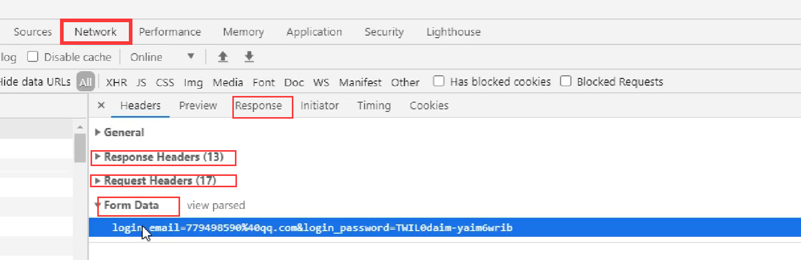

## AJAX-HTTP协议请求报文与响应文本结构

````markdown
#HTTP
HTTP(hypertext transport protoco1)协议 超文本传输协议，协议详细规定了浏览器和万维网服务器之间互相通信的规则，约定。


##请求报文
重点是格式与参数
```
行
POST /s?ie=utf-8
HTTP/1.1
头
Host:atguigu.com
Cookie:name=guigu
Content-type:application/x-www-form-urlencoded
User-Agent:chrome 83
空行
体
username=admin&password=admin
```

#响应报文
行
HTTP/1.1
200
OK
头
Content-Type:text/html;charset=utf-8
Content-length:2048
Content-encoding:gzip
空行
体
<html>
<head>
</head>
<body>
<h1>尚硅谷</h1>
</body>
</html>
````

## Chrome查看网络通信报文



## 安装node.js

```text
安装完之后在
cmd里
输入
node -v
如果出现版本号说明成功
```

## express

```text
在项目里
npm init --yes
npm i express
```

切换到对应目录

运行node expressUSE.js

下面是expressUSE.js文件

```javascript
const express=require('express');
const app=express();
app.get('/',(request,response)=>{

    response.send('HELLO EXPRESS'); 
})
app.listen(8000,()=>{
    console.log("服务启动，端口8000监听中");
})
```

## 原生ajax

### get.html

```html
<!DOCTYPE html>
<html lang="en">
<head>
    <meta charset="UTF-8">
    <meta http-equiv="X-UA-Compatible" content="IE=edge">
    <meta name="viewport" content="width=device-width, initial-scale=1.0">
    <title>AJAX GET 请求</title>
    <style>
        #result {
            width: 200px;
            height: 200px;
            border: solid 1px green;
        }
    </style>
</head>
<body>
    <button>点击发送请求</button>
    <div id="result"></div>
    <script>
        const btn=document.getElementsByTagName('button')[0];
        const result=document.getElementById('result');
        btn.onclick=function(){
            const xhr=new XMLHttpRequest();
            xhr.open('GET','http://127.0.0.1:8000/server?a=100&b=200&c=300');
            xhr.send();
            xhr.onreadystatechange=function(){
                if(xhr.readyState===4){
                    if(xhr.status>=200&&xhr.status<300){

                        console.log(xhr.status);//状态码
                        console.log(xhr.statusText);//状态字符串
                        console.log(xhr.getAllResponseHeaders());//所有响应头
                        console.log(xhr.response);//响应体
                        result.innerHTML=xhr.response;
                    }
                }
            }
        }
    </script>
</body>
</html>
```

### post.html

```html
<!DOCTYPE html>
<html lang="en">
<head>
    <meta charset="UTF-8">
    <meta http-equiv="X-UA-Compatible" content="IE=edge">
    <meta name="viewport" content="width=device-width, initial-scale=1.0">
    <title>AJAX GET 请求</title>
    <style>
        #result {
            width: 200px;
            height: 200px;
            border: solid 1px green;
        }
    </style>
</head>
<body>
    <button>点击发送请求</button>
    <div id="result"></div>
    <script>
        const btn=document.getElementsByTagName('button')[0];
        const result=document.getElementById('result');
        btn.onclick=function(){
            const xhr=new XMLHttpRequest();
            xhr.open('POST','http://127.0.0.1:8000/server');
            xhr.setRequestHeader('Content-Type','application/x-www-form-urlencoded')
            xhr.setRequestHeader('myname','lqx')
            xhr.send('a=100&b=200&c=300');
            xhr.onreadystatechange=function(){
                if(xhr.readyState===4){
                    if(xhr.status>=200&&xhr.status<300){

                        console.log(xhr.status);//状态码
                        console.log(xhr.statusText);//状态字符串
                        console.log(xhr.getAllResponseHeaders());//所有响应头
                        console.log(xhr.response);//响应体
                        result.innerHTML=xhr.response;
                    }
                }
            }
        }
    </script>
</body>
</html>
```

### server.js

```javascript
const express=require('express');
const app=express();

// app.get('/server',(request,response)=>{
//     response.setHeader('Access-Control-Allow-Origin','*');
//     response.send('HELLO AJAX GET');
// })

// app.post('/server',(request,response)=>{
//     response.setHeader('Access-Control-Allow-Origin','*');
//     response.send('HELLO AJAX POST');
// })

//设置自定义请求头需要用all
app.all('/server',(request,response)=>{
    response.setHeader('Access-Control-Allow-Origin','*');
    response.setHeader('Access-Control-Allow-Headers','*');
    response.send('HELLO AJAX ALL');
})

app.listen(8000,()=>{
    console.log("服务启动，端口8000监听中");
})
```

### json.html

```html
<!DOCTYPE html>
<html lang="en">
<head>
    <meta charset="UTF-8">
    <meta http-equiv="X-UA-Compatible" content="IE=edge">
    <meta name="viewport" content="width=device-width, initial-scale=1.0">
    <title>AJAX GET 请求</title>
    <style>
        #result {
            width: 200px;
            height: 200px;
            border: solid 1px green;
        }
    </style>
</head>
<body>
    <button>按键盘</button>
    <div id="result"></div>
    <script>
          const result=document.getElementById('result');
        window.onkeydown=function(){
            const xhr=new XMLHttpRequest();
            //设置响应类型
            xhr.responseType='json';
            xhr.open('GET','http://127.0.0.1:8000/jsonserver');
            xhr.send();
            xhr.onreadystatechange=function(){
                if(xhr.readyState===4){
                    if(xhr.status>=200&&xhr.status<300){
                        //没设置xhr.responseType='json';
                        //let data=JSON.parse(xhr.response);
                        //console.log(data);
                        console.log(xhr.response);//响应体
                        result.innerHTML=xhr.response.name;
                    }
                }
            }
        }
    </script>
</body>
</html>
```

### jsonserver.js

```javascript
const express=require('express');
const app=express();

// app.get('/jsonserver',(request,response)=>{
//     response.setHeader('Access-Control-Allow-Origin','*');
//     response.send('HELLO AJAX GET');
// })

// app.post('/server',(request,response)=>{
//     response.setHeader('Access-Control-Allow-Origin','*');
//     response.send('HELLO AJAX POST');
// })

//设置自定义请求头需要用all
app.all('/jsonserver',(request,response)=>{
    response.setHeader('Access-Control-Allow-Origin','*');
    response.setHeader('Access-Control-Allow-Headers','*');
    const data={
        name:'HELLO AJAX ALL JSON'
    }
    let str=JSON.stringify(data); 
    response.send(str);
})

app.listen(8000,()=>{
    console.log("服务启动，端口8000监听中");
})
```

## nodemon工具

ps:这里安装失败了，我跳过了这部分。

解决重启服务操作麻烦

```text
安装
npm install -g 	nodemon
运行js文件
nodemon ---.js

```

## 请求超时和网络异常

```javascript
const xhr =new XMLHttpRequest();
//超时设置2s设置
xhr.timeout =2000;
//超时回调
xhr.ontimeout =function(){
a1ert("网络异常，请稍后重试！！");
}
//网络异常回调
xhr.onerror= function()
a1ert("你的网络似乎出了一些问题！");
```

## 取消请求

```javascript
const xhr =new XMLHttpRequest();
xhr.abort();
```

## jquery发送ajax

client.html

```html
<!DOCTYPE html>
<html lang="en">
<head>
    <meta charset="UTF-8">
    <meta http-equiv="X-UA-Compatible" content="IE=edge">
    <meta name="viewport" content="width=device-width, initial-scale=1.0">
    <title>jQuery发送ajax</title>
    <script src="https://cdn.bootcdn.net/ajax/libs/jquery/3.6.0/jquery.js"></script>
</head>
<body>
    <div>
        <button>get</button>
        <button>post</button>
        <button>通用</button>
    </div>
    <script>
        $('button').eq(0).click(function(){
            $.get('http://127.0.0.1:8000/jqueryserver',{a:100,b:200},function(data){
                console.log(data);
            })
        })
        // $('button').eq(0).click(function(){
        //     $.get('http://127.0.0.1:8000/jqueryserver',{a:100,b:200},function(data){
        //         console.log(data);
        //     },'json')//自动返回json转换数据格式
        // })
        $('button').eq(1).click(function(){
            $.post('http://127.0.0.1:8000/jqueryserver',{a:100,b:200},function(data){
                console.log(data);
            })
        })
        $('button').eq(2).click(function(){
            $.ajax({
                url:'http://127.0.0.1:8000/jqueryserver',
                data:{a:100,b:200},
                type:'GET',
                success:function(data){
                        console.log(data);
                },
                timeout:2000,
                error:function(){
                    console.log('error');
                },
                headers:{
                    c:300,
                    d:400
                }
            })
        })
    </script>
</body>
</html>
```

jqueryserver

```javascript
const express=require('express');
const app=express();

// app.get('/jqueryserver',(request,response)=>{
//     response.setHeader('Access-Control-Allow-Origin','*');
//     response.send('HELLO AJAX GET');
// })

// app.post('/jqueryserver',(request,response)=>{
//     response.setHeader('Access-Control-Allow-Origin','*');
//     response.send('HELLO AJAX POST');
// })

//设置自定义请求头需要用all
app.all('/jqueryserver',(request,response)=>{
    response.setHeader('Access-Control-Allow-Origin','*');
    response.setHeader('Access-Control-Allow-Headers','*');
    response.send('HELLO AJAX ALL jQuery');
})

app.listen(8000,()=>{
    console.log("服务启动，端口8000监听中");
})
```

## axios发送请求

axios.html

```html
<!DOCTYPE html>
<html lang="en">
<head>
    <meta charset="UTF-8">
    <meta http-equiv="X-UA-Compatible" content="IE=edge">
    <meta name="viewport" content="width=device-width, initial-scale=1.0">
    <script src="https://cdn.bootcdn.net/ajax/libs/axios/0.27.2/axios.js"></script>
    <title>axios AJAX</title>
</head>
<body>
    <button>get</button>
    <button>post</button>
    <button>ajax</button>
    <script>
        axios.defaults.baseURL='http://127.0.0.1:8000';
        const btn=document.querySelectorAll('button');
        btn[0].onclick=function(){
            axios.get('/axiosserver',{
                params:{
                    id:100,
                    vip:7
                },
                headers:{
                    name:'lqx',
                    age:'20'
                },

            }).then(value=>{
                console.log(value);
            })
        }
        btn[1].onclick=function(){
            axios.post('/axiosserver',{a:100,b:200},{
                params:{
                    id:100,
                    vip:7
                },
                headers:{
                    name:'lqx',
                    age:'20'
                },

            }).then(value=>{
                console.log(value);
            })
            
            
        }
        btn[2].onclick=function(){
            axios({
                url:'/axiosserver',
                method:'POST',
                params:{
                    id:100,
                    vip:7
                },
                headers:{
                    name:'lqx',
                    age:'20'
                },
                data:{
                    a:100,
                    b:200
                }
            }).then(response=>{
                console.log(response);
            })
        }
    </script>
</body>
</html>
```

axiosserver.js

```javascript
const express=require('express');
const app=express();

// app.get('/axiosserver',(request,response)=>{
//     response.setHeader('Access-Control-Allow-Origin','*');
//     response.send('HELLO AJAX GET');
// })

// app.post('/axiosserver',(request,response)=>{
//     response.setHeader('Access-Control-Allow-Origin','*');
//     response.send('HELLO AJAX POST');
// })

//设置自定义请求头需要用all
app.all('/axiosserver',(request,response)=>{
    response.setHeader('Access-Control-Allow-Origin','*');
    response.setHeader('Access-Control-Allow-Headers','*');//设置自定义请求头
    response.send('HELLO AJAX ALL jQuery');
})

app.listen(8000,()=>{
    console.log("服务启动，端口8000监听中");
})
```

## 跨域

首先狭义的同源就是指，域名、协议、端口均为相同。

跨域，是指浏览器不能执行其他网站的脚本。它是由**浏览器的同源策略**造成的，是浏览器对JavaScript实施的安全限制。 这里说明一下，无法跨域是浏览器对于用户安全的考虑，如果自己写个没有同源策略的浏览器，完全不用考虑跨域问题了。是浏览器的锅，对。 同源策略限制了一下行为： Cookie、LocalStorage 和 IndexDB 无法读取 DOM 和 JS 对象无法获取 Ajax请求发送不出去

**如何实现跨域请求呢？**

### 1、jsonp

利用了 script 不受同源策略的限制

缺点：只能 get 方式，易受到 XSS攻击


### 2、CORS（Cross-Origin Resource Sharing）,跨域资源共享

当使用XMLHttpRequest发送请求时，如果浏览器发现违反了同源策略就会自动加上一个请求头 origin；

后端在接受到请求后确定响应后会在 Response Headers 中加入一个属性 Access-Control-Allow-Origin；

浏览器判断响应中的 Access-Control-Allow-Origin 值是否和当前的地址相同，匹配成功后才继续响应处理，否则报错

缺点：忽略 cookie，浏览器版本有一定要求
