# Java版本

java 8，11，17是长期支持（LTS）版本

# Java重要特点

1. Java语言是面向对象的(oop)
2. Java语言是健壮的。Java的强类型机制、异常处理、垃圾的自动收集等是Java程序健壮性的重要保证
3. Java语言是跨平台性的。[即：一个编译好的.class文件可以在多个系统(linux,windows,mac)下运行，这种特性
   称为跨平台]
4. Java语言是解释型的[了解]
   解释性语言：javascript,PHP,java编译性语言：c/c++
   区别是：解释性语言，编译后的代码，不能直接被机器执行，需要解释器来执行，编译性语言，
   编译后的代码，可以直接被机器执行，c/c++

# Java的开发工具

1. editplus、notepad++
2. Sublime Text
3. IDEA
4. eclipse

ps：我用的是IDEA

# JVM,JDK,JRE

### JVM基本介绍

1. JVM是一个虚拟的计算机，具有指令集井便用不同的字储区域。负责执行指令，管理数据、内存、寄存器，包含在JDK中
2. 对于不同的平台，有不同的虚拟机。
3. Java虚拟机机制屏蔽了底层运行平台的差别，实现了"一次编译，到处运行"

### JDK基本介绍

1. JDK的全称(Java Development Kit Java开发工具包)
   JDK=JRE+java的开发工具[java,javac,javadoc,javap等]
2. JDK是提供给Java开发人员使用的，其中包含了java的开发工具，也包括了JRE,所以安装了JDK,就不用在单独安装JRE了。


### JRE基本介绍

1. JRE(Java Runtime EnvironmentJava运行环境)JRE=JVM+Java的核心类库[类]

2. 包括Java虚拟机VM Java Virtual Machine)和Java程序所需的核心类库等，如果想要运行一个开发好的java程序，计算机中只需要安装JRE即可。

### JDK、JRE和JVM的包含关系

1.JDK=JRE+开发工具集（例如Javac,java编译工具等）
2.JRE=JVM+Java SE标准类库(Java核心类库)
3.如果只想运行开发好的.class.文件只需要JRE

# java开发细节

1. Java源文件以java为扩展名。源文件的基本组成部分是类(class),如本类中的Hello类。
2. Java应用程序的执行入口是main()方法。它有固定的书写格式：
   public static void main(String[] args){...}
3. Java语言严格区分大小写。
4. Java方法由一条条语句构成，每个语句以";”结束。
5. 大括号都是成对出现的，缺一不可。[习惯，先写{}再写代码]
6. 一个源文件中最多只能有一个public类。其它类的个数不限。
7. 如果源文件包含一个public类，则文件名必须按该类名命名！
8. 一个源文件中最多只能有一个public类。其它类的个数不限，也可以将main方法写在非public类中，然后指定运行非public类，这样入口方法就是非public的main方法

# Java常用的转义字符

1)\t:一个制表位，实现对齐的功能（tab键）
2)\n:换行符
3)\\\:一个\
4)\\":一个”
5)\\':一个'
6)\r:一个回车

## \r、\n、以及\r\n的区别(了解)

\r ：将当前位置移到本行开头。又叫回车，对应键盘上的return键
\n：将当前位置移到下一行开头。又叫换行，newline。

这时候可能就有人陷入了思考中，在文本中回车不就相当于换行了吗？换行不就相当于到了下一行了吗？其实按道理说这样理解是没有问题的，但是在不同的操作系统中，换行是由不同的方式来表示的。

Linux中\n表示回车并换行；
Windows中\r\n表示回车并换行。
Mac中\r表示回车并换行。

# java注释

1. 快捷键ctrl+/
2. //
3. /*   ...       */

## java文档注释

Javadoc 工具可以识别文档注释中的一些特殊标签，这些标签一般以`@`开头，后跟一个指定的名字，有的也以`{@`开头，以`}`结束。

```java
/**
 *  @author fanlangke
 *  @version 1.0
 */

public class hello{
        public static void main(String[] args){

        }
}

```


```bash
javadoc -author -version -encoding UTF-8 hello.java
javadoc -d 保存位置 -author -version -encoding UTF-8 hello.java
```

# java代码规范

```text
1.类、方法的注释，要以javadoc的方式来写。
2.非Java Doc的注释，往往是给代码的维护者看的，着重告述读者为什么这样写，
如何修改，注意什么问题等
3.使用tab操作，实现缩进，默认整体向右边移动，时候用shift+tab整体向左移
4.运算符和=两边习惯性各加一个空格。比如：2 + 4 * 5 + 345 - 89
5.源文件使用utf-8编码
6.行宽度不要超过80字符
7.代码编写次行风格和行尾风格
行尾风格,推荐
int main(){
	return 0;
}
次行风格
int main()
{
	return 0;
}
```

# dos命令

Disk Operating System磁盘操作系统

```bash
#相关的知识补充：相对路径，绝对路径
#常用的dos命令
#1.查看当前目录是有什么内容dir
dir Desktop
#2.切换到其他盘下：盘符号cd:change directory
#案例演示：切换到c盘
cd /D c:
#3.切换到当前盘的其他目录下（使用相对路径和绝对路径演示），…表示上一级目录
案例演示：cd desktop
#4.切换到上一级：
案例演示：cd ..
#5.切换到根目录：cd \
案例演示：cd \
#6.查看指定的目录下所有的子级目录
tree
#7.清屏
cls
#8.退出DOS
exit
#9.说明：因为小伙伴后面使用DOS非常少，所以对下面的几个指令，老韩给大家演示下，
大家了解即可(md[创建目录]，rd[删除目录]，copy[拷贝文件]，del[删除文件]，echo[输入内容到文件]，type,move[剪切])
```

# instanceof

| instanceof | 用于判断对象的运行类型是否为XX类型或XX类型的子类型 | "hsp" instanceof  String | true |
| ---------- | -------------------------------------------------- | ------------------------ | ---- |

# 键盘输入输出

```java
import java.util.Scanner;
public class hello{
        public static void main(String[] args){
                Scanner myScanner=new Scanner(System.in);
                String myname=myScanner.next();
                System.out.println(myname);
        }
}

```

# 面向对象(OOP)

```java
class Cat {
    String name;
    int age;
    String color;
}
```


# 方法重载(OverLoad)

##### 基本介绍

java中允许同一个类中，多个同名方法的存在，但要求形参列表不一致！
比如：System.out.printIn();out是PrintStream类型

##### 重载的好处

1)减轻了起名的麻烦
2)减轻了记名的麻烦

# 可变参数

java允许将同一个类中多个同名同功能但参数个数不同的方法，封装成一个方法。
就可以通过可变参数实现

下面结果输出15

```java
import java.util.Scanner;
public class hello{
        public static void main(String[] args){
                Method m=new Method();
                System.out.println(m.sum(1,2,3,4,5));
        }
}
class Method{
        public int sum(int ...arr) {
                int a = 0;
                for (int i = 0; i < arr.length; i++) {
                        a += arr[i];
                }
                return a;
        }
}
```

# 构造方法/构造器

1. 看一个需求
   我们来看一个需求：前面我们在创建人类的对象时，是先把一个对象创建好后，再给
   他的年龄和姓名属性赋值，如果现在我要求，在创建人类的对象时，就直接指定这个
   对像的年龄和姓名，该怎么做？这时就可以使用构造器。

2. 基本语法
   ```java
   [修饰符]  方法名 （形参列表）{
   	方法体;
   }
   ```

   1)构造器的修饰符可以默认
   2)构造器没有返回值
   3)方法名和类名字必须一样
   4)参数列表和成员方法一样的规则
   5)构造器的调用系统完成

   ```java
   import java.util.Scanner;
   public class hello{
           public static void main(String[] args){
                   Person p=new Person("fanlangke",18);
                   System.out.println(p.name+p.age);
           }
   }
   class Person{
           String name;
           int age;
           //构造器
           public Person(String pName,int pAge){
                   name=pName;
                   age=pAge;
           }
   }
   ```

   ```text
   输出
   fanlangke18
   ```


# this

   简单的说，哪个对象调用，this就代表哪个对象

      1. this关键字可以用来访问本类的属性、方法、构造器
      2. ths用于区分当前类的属性和局部变量
      3. 访问成员方法的语法：this.方法名（参数列表）：
      4. 访问构造器语法：this(参数列表)：注意只能在构造器中使用（即只能在构造器中访问另外一个构造器，必须放在第一条语句)
      5. this不能在类定义的外部使用，只能在类定义的方法中使用。

# IDEA常用快捷键

1)删除当前行，默认是ctrl+Y自己配置ctrl+d
2)复制当前行，自己配置ctrl+alt+向下光标
3)补全代码alt+/
4)添加注释和取消注释ctrl+/【第一次是添加注释，第二次是取消注释】
5)导入该行需要的类先配置auto import,然后使用alt+enter即可
6)快速格式化代码ctrl+alt+L
7)快速运行程序自己定义alt+R
8)生成构造器等alt+insert[提高开发效率]
9)查看一个类的层级关系ctrl+H[学习继承后，非常有用]
10)将光标放在一个方法上，输入ctrl+B,可以定位到方法[学继承后，非常有用]
11)自动的分配变量名，通过在后面加.var[老师最喜欢的]
12)还有很多其它的快捷键.
13)ctrl+alt+T

# 包

##### 包的命名

只能包含数字、字母、下划线、小圆点，但不能用数字开头，不能是关键字或保留字

##### 命名规范

一般是小写字母+小圆点

一般是com.公司名.项目名.业务模块名

##### 常用的包

一个包下，包含很多的类，java中常用的包有：
```text
java.lang.*
/lang包是基本包，默认引入，不需要再引入.
java.util.*
/util包，系统提供的工具包，工具类，使用Scanner
java.net.*
/网络包，网络开发
java.awt.*
/是做java的界面开发，GUI
```

##### 包引入

```text
注意事项和使用细节
1.package的作用是声明当前类所在的包，
需要放在的最上面而一个类中最多只有一句package
2.import指令位置放在package的下面，在类定义前面，可以有多句且没有顺序要求。
```

# 访问修饰符

1. 公开级别：用public修饰，对外公开
2. 受保护级别：用protected修饰，对子类和同一个包中的类公开
3. 默认级别没有修饰符号，向同一个包的类公开.
4. 私有级别：用private修饰，只有类本身可以访问，不对外公开.
5. 

# 封装

##### 封装的实现步骤

```text
1)将属性进行私有化【不能直接修改属性】

2)提供一个公共的set方法，用于对属性判断并赋值
public void setXxx(类型参数名){
	//加入数据验证的业务逻辑
	属性=参数名;
}

3)提供一个公共的get方法，用于获取属性的值
public XX getXxx(){//权限判断
	return XX;
}
```


# 继承

```java
//让Pupil 继承 Student类
public class Pupil extends Students{
        public void testing(){
                System.out.println("小学生");
        }
}
```

##### 细节

1. 子类继承了所有的属性和方法，但是私有属性和方法不能在子类直接访问，要通过公共的方法去访问
2. 子类必须调用父类的构造器，完成父类的初始化
3. 当创建子类对象时，不管使用子类的哪个构造器，默认情况下总会去调用父类的无参构造器，如果父类没有提供无参构造器，则必须在子类的构造器中用super去指定使用父类的哪个构造器完成对父类的初始化工作，否则，编译不会通过
4. 如果希望指定去调用父类的某个构造器，则显式的调用一下
5. super在使用时，需要放在构造器第一行
6. super())和this()都只能放在构造器第一行，因此这两个方法不能共存在一个构造器
7. java所有类都是Object类的子类
8. 父类构造器的调用不限于直接父类！将一直往上追溯直到Object类（顶级父类）
9. 子类最多只能继承一个父类


## super

1.访问父类的属性，但不能访问父类的private属性[案例]
super.属性名；
2.访问父类的方法，不能访问父类的private方法
super.方法名（参数列表）：
3.访问父类的构造器（这点前面用过）：
super(参数列表);只能放在构造器的第一句，只能出现一句！

# 方法重写（override）

简单的说：方法覆盖（重写）就是子类有一个方法，和父类的某个方
法的名称、返回类型、参数一样，那么我们就说子类的这个方法
覆盖了父类的那个方法

# 多态

1.方法的多态PloyMethod.java
重写和重载就体现多态

2.对象的多态（核心，因难，重点）
老韩重要的几句话（记住）：
(1)一个对象的编译类型和运行类型可以不一致
(2)编译类型在定义对象时，就确定了，不能改变
(3)运行类型是可以变化的.
(4)编译类型看定义时=号的左边，
运行类型看=号的右边

```java
Animal animal=new Dog();
【animal编译类型是Animal,运行类型Dog】
animal=new Cat();
【animal的运行类型变成了Cat,编译类型仍然是Animal】
```

```java
public void feed(Animal animal,Bone bone){
        System.out.println("主人"+name+"给"+animal.getName()+"吃"+food.getName());
}
```

## 向上/向下转型

运行类型和编译类型

## 动态绑定机制

当调用对象方法的时候，该方法会和该对象的内存地址/运行类型绑定

当调用对象属性时，没有动态绑定机制，哪里声明，那里使用

# object

1. equals:是object类中的方法，只判断引用类型。String类对equals方法进行了重写，用来比较指向的字符串对象所存储的字符串是否相等。其他的一些类诸如Double，Date，Integer等，都对equals方法进行了重写用来比较指向的对象所存储的内容是否相等。
1. “java”中使用“if”语句判断字符串是否相等的方法是：可以使用**“==”或者“equals”方法**，两者都可以比较字符串是否相等，但是不同的是，“==”比较的是两个字符串的地址是否相等，“equals”方法比较的是字符串对象的内容是否相同。
2. hashcode()
3. toString()
4. finalize()

# 类变量

```text
1.什么时候需要用类变量
当我们需要让某个类的所有对象都共享一个变量时，就可以考虑使用类变量（静态变量：比如：定义学生类，统计所有学生共交多少钱Student(name,static fee)
2.类变量与实例变量（普通属性）区别
类变量是该类的所有对象共享的，而实例变量是每个对象独享的。
3.加上static称为类变量或静态变量，否则称为实例变量/普通变量/非静态变量
4.类变量可以通过类名.类变量名或者对象名.类变量名来访问，但java设计者推荐
我们使用类名类变量名方式访问。【前提是满足访问修饰符的访问权限和范围】
```

# main

# 代码块

普通代码块

静态代码块

构造方法（构造器）的最前面其实隐含了super()和调用普通代码块

# 单例设计模式

饿汉式

懒汉式

# final


# 抽象类


# 接口


# 内部类


# 枚举


# 注解


# 异常

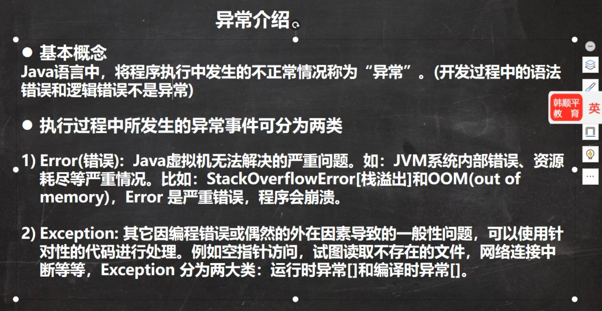


# 包装类


## String类


## stringbuffer


## stringbuilder


## math类


## arrays类


## system类


## bigInteger和bigDecimal


## Date类


## calendar


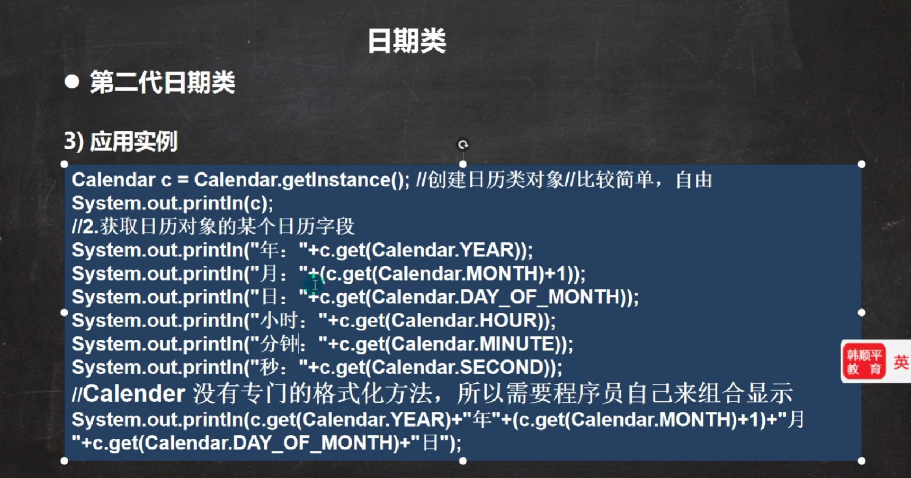

## 第三代日期类


# 集合（容器）


## collection常用方法


## 迭代器遍历


## 集合增强for


## List


### ArrayList


### Vector

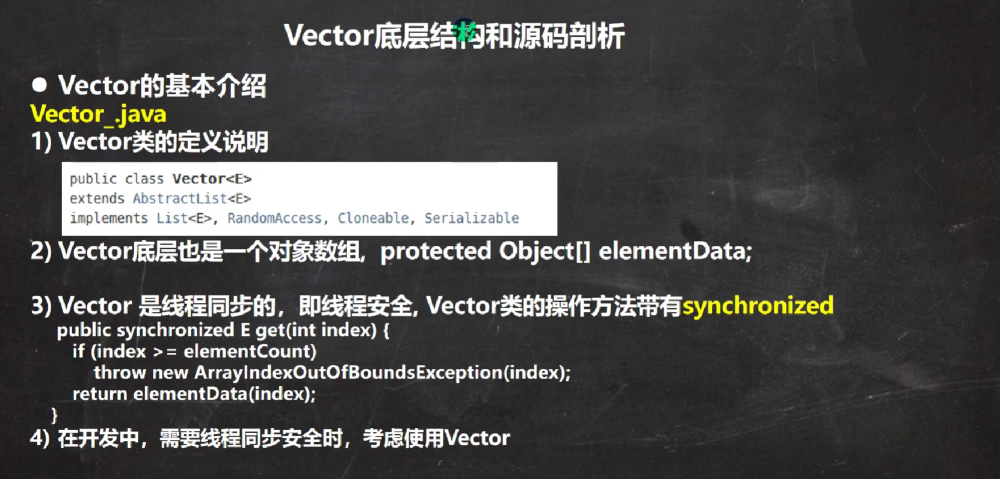


### LinkedList


## Set


### HashSet


#### LinkedHashSet

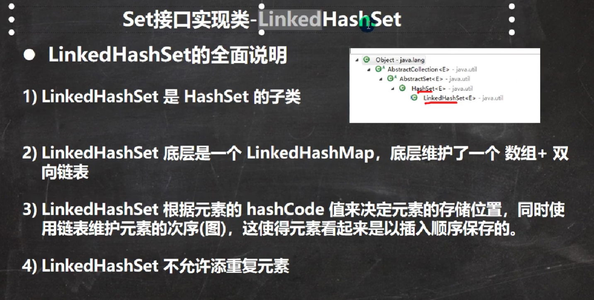

## Map


### HashMap


### HashTable


### properties


## 集合选型

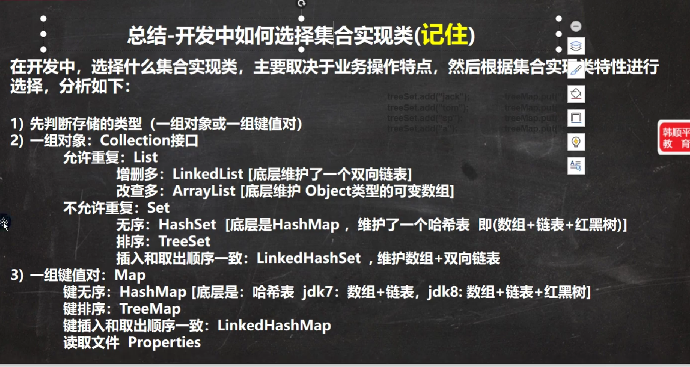

## collection工具类


# 泛型


### 自定义泛型


# java绘图


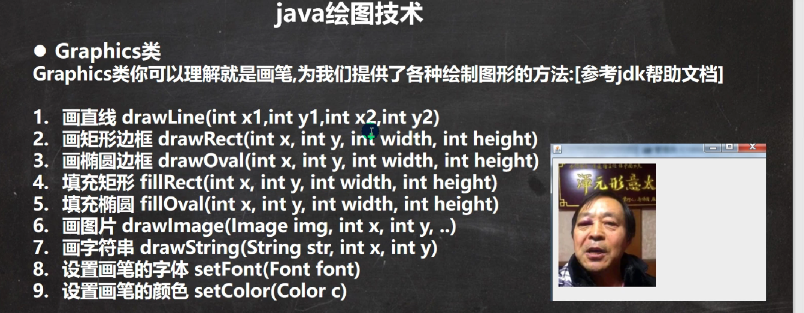

# 线程


## 创建线程


## 终止线程


## 线程方法


## 插队线程


## 守护线程


## 线程状态


## 线程同步


# 锁

## 互斥锁


## 死锁


## 释放锁


# IO流

## 创建文件


## 获取文件


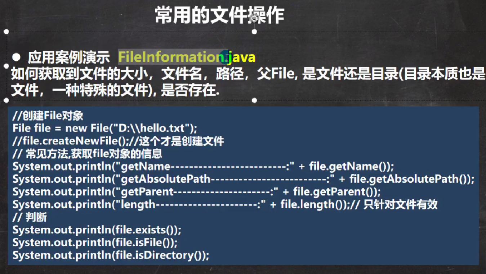

## 文件删除


## IO流原理

### 概况


### 节点流

#### FileInputStream


#### FileOutputStream


#### FileReader和FileWriter

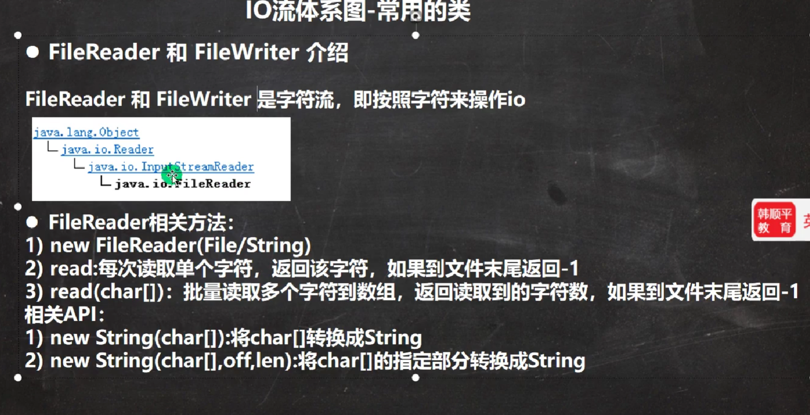


#### FileReader


#### FileWriter


### 节点流和处理流


#### BufferedReader和BufferedWriter


#### BufferedInputStream和BufferedOutputStream


### 对象流


### 标准输入输出流

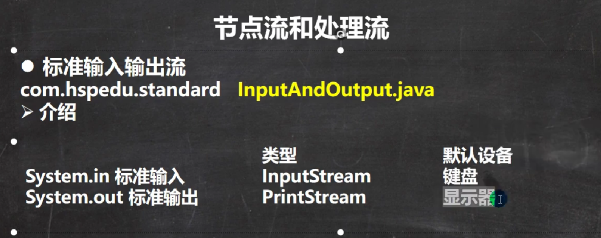

### 转换流

#### InputStreamReader和OutputStreamWriter


#### PrintStream和PrintWriter


## properties


# 网络编程

## 网络


## ip地址


## 域名和端口


## 网络协议

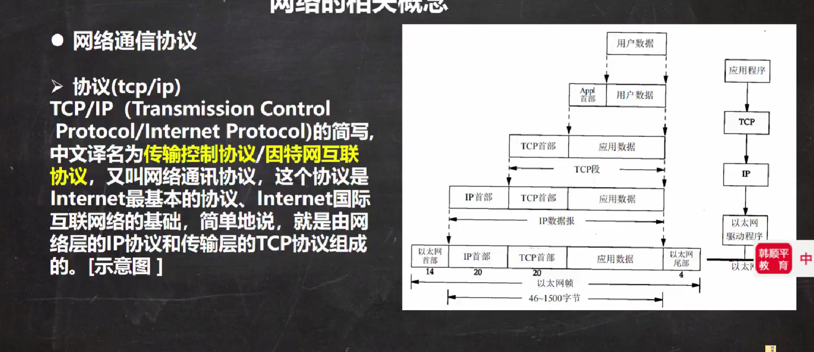


## TCP和UDP


### TCP

#### 01

```text
1.编写一个服务器端，和一个客户端
2.服务器端在9999端口监听
3.客户端连接到服务器端，发送"hello,,server",然后退出
4.服务器端接收到客户端发送的信息，输出，并退出
```

```java
package com.lqx.socket;

import java.io.IOException;
import java.io.InputStream;
import java.io.OutputStream;
import java.net.ServerSocket;
import java.net.Socket;

public class tcp01server {
    public static void main(String[] args) throws IOException {
        ServerSocket serverSocket = new ServerSocket(9999);
        System.out.println("服务端在端口9999监听");
        Socket socket = serverSocket.accept();
        System.out.println("服务端socket"+socket.getClass());
        InputStream iuputStream = socket.getInputStream();
        byte[] buf = new byte[1024];
        int readlen=0;
        while ((readlen=iuputStream.read(buf))!=-1) {
            System.out.println(new String(buf,0, readlen));//根据读取到的实际长度，显示内容，

        }
        //5.关闭流和socket
        iuputStream.close();
        socket.close();
        serverSocket.close();//关闭


    }
}

```

```java
package com.lqx.socket;

import java.io.IOException;
import java.io.OutputStream;
import java.net.InetAddress;
import java.net.Socket;
import java.net.UnknownHostException;

public class tcp01client {
    public static void main(String[] args) throws IOException {
        Socket socket = new Socket(InetAddress.getLocalHost(),9999);
        OutputStream outputstream =socket.getOutputStream();
//3。通过输出流，写入数据到数据通道
        outputstream.write("hello,server".getBytes());
//4.关闭流对象和socket,必须关闭
        outputstream.close();
        socket.close();
        System.out.println("客户端退出");
    }
}

```

#### 02

```text
1.编写一个服务端，和一个客户端
2.服务器端在9999端口监听
3.客户端连接到服务端，发送"hello,server'",并接收服务器端回发的
"hello,client",再退出
4.服务器端接收到客户端发送的信息，输出，并发送"hello,,client'",再退出
```

```java
package com.lqx.socket;

import java.io.IOException;
import java.io.InputStream;
import java.io.OutputStream;
import java.net.ServerSocket;
import java.net.Socket;

public class tcp02server {
    public static void main(String[] args) throws IOException {
        ServerSocket serverSocket = new ServerSocket(9999);
        System.out.println("服务端在端口9999监听");
        Socket socket = serverSocket.accept();
        System.out.println("服务端socket"+socket.getClass());
        InputStream iuputStream = socket.getInputStream();
        byte[] buf = new byte[1024];
        int readlen=0;
        while ((readlen=iuputStream.read(buf))!=-1) {
            System.out.println(new String(buf,0, readlen));//根据读取到的实际长度，显示内容，

        }
        OutputStream outputstream =socket.getOutputStream();
        outputstream.write("hello,client".getBytes());
        socket.shutdownOutput();


        //5.关闭流和socket
        iuputStream.close();
        socket.close();
        serverSocket.close();//关闭
        outputstream.close();


    }
}

```

```java
package com.lqx.socket;

import java.io.IOException;
import java.io.InputStream;
import java.io.OutputStream;
import java.net.InetAddress;
import java.net.Socket;
import java.net.UnknownHostException;

public class tcp02client {
    public static void main(String[] args) throws IOException {
        Socket socket = new Socket(InetAddress.getLocalHost(),9999);
        OutputStream outputstream =socket.getOutputStream();
//3。通过输出流，写入数据到数据通道
        outputstream.write("hello,server".getBytes());
        socket.shutdownOutput();
        InputStream iuputStream = socket.getInputStream();
        byte[] buf = new byte[1024];
        int readlen=0;
        while ((readlen=iuputStream.read(buf))!=-1) {
            System.out.println(new String(buf,0, readlen));//根据读取到的实际长度，显示内容，

        }

//4.关闭流对象和socket,必须关闭
        outputstream.close();
        socket.close();
        System.out.println("客户端退出");
    }
}

```


### UDP


## InetAddress类


## socket


## netstat


# 反射


## 反射原理


## 反射相关类


## 反射调用优化


## Class类


## 获取class类


##  哪些类型有class对象

## 类加载


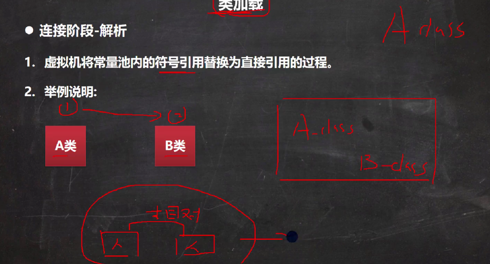

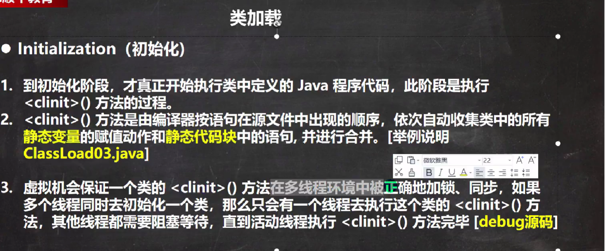

## 反射api


## 反射暴破


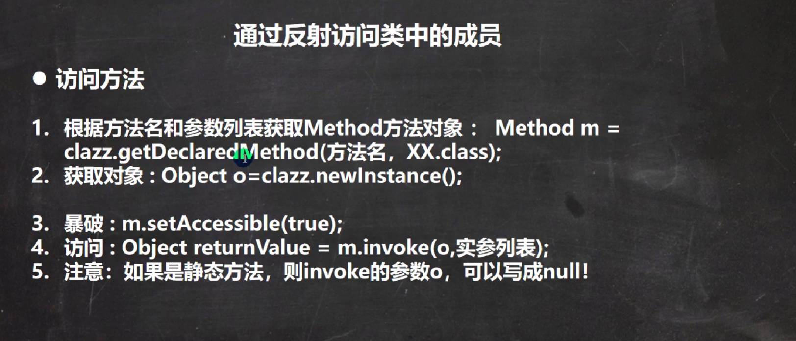
