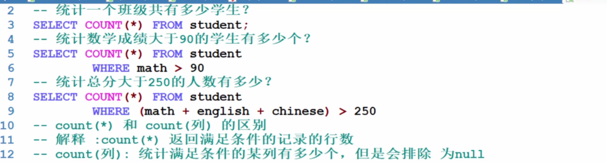
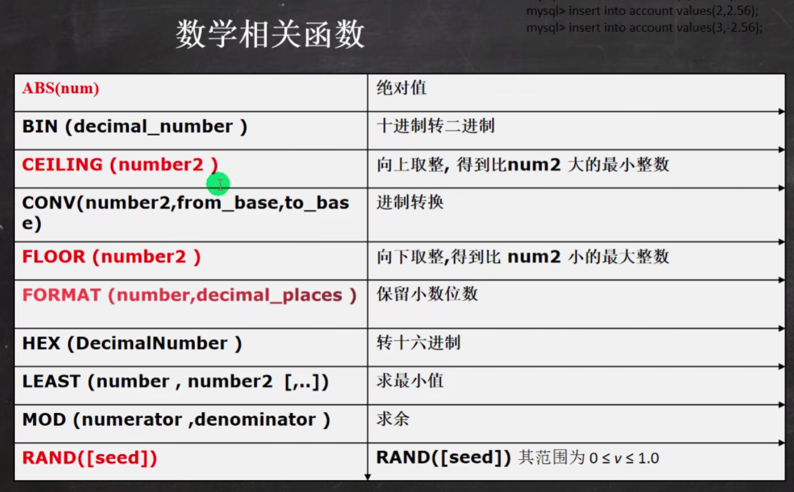

# MYSQL

## 安装MYSQL

选一个即可

[--1--](https://blog.csdn.net/weixin_43605266/article/details/110477391)

[--2--](https://blog.csdn.net/weixin_48557496/article/details/113185052)

[--3--](https://www.bilibili.com/video/BV1Qf4y1T7Hx)

[--4--](https://www.bilibili.com/video/BV1fh411y7R8)

## 下载图形化客服端工具

navicat或者sqlyog

## 数据库

存储数据的仓库，数据是有组织的进行存储。
英文：DataBase,简称DB

### 数据库管理系统

管理数据库的大型软件。
英文：DataBase Management System,简称DBMS

### SQL

英文：Structured Query Language,简称SQL,结构化查询语言
操作关系型数据库的编程语言
定义操作所有关系型数据库的统一标准

### DDL	DML	DQL	DCL

DDL:	操作数据库，表等
DML：对表中的数据进行增删改
DQL：对表中的数据进行查询
DCL：对数据库进行权限控制

### 创建数据库

```mysql
#创建数据库
CREATE DATABASE 数据库名称;
#创建数据库（判断，如果不存在则创建）
CREATE DATABASE IF NOT EXISTS 数据库名称;
```


### 查询数据库

```mysql
#香看当前数据库服务器中的所有数据库
SHOW DATABASES
#查看前面创建的hsp db01数据库的定义信息
SHOW CREATE DATABASE `hsp_db01`
```

### 删除数据库

```mysql
#删除数据库
DROP DATABASE `hsp_db01`
#删除数据库（判断，如果存在则删除）
DROP DATABASE IF EXISTS `hsp_db01`
#数据库名称;
```


### 使用数据库

```mysql
#使用数据库
#查看当前使用的数据库
SELECT DATABASE();
#使用数据库
USE 数据库名称；
```


### 备份恢复数据库


​	


## 表

### 查询表

```mysql
#查询表
#·查询当前数据库下所有表名称
SHOW TABLES;
#·查询表结构
DESC 表名称;
```


### 创建表

```mysql
CREATE TABLE 表名 (
	字段名1	数据类型1,
	字段名2	数据类型2,
    ...
	字段名n	数据类型n
    );
```


### 修改表

```mysql
#1.修改表名
ALTER TABLE 表名 RENAME TO 新的表名;
#2.添加一列
ALTER TABLE 表名 ADD 列名数据类型;
#3.修改数据类型
ALTER TABLE 表名 MODIFY 列名 新数据类型;
#4.修改列名和数据类型
ALTER TABLE 表名 CHANGE 列名 新列名 新数据类型;
#5.删除列
ALTER TABLE 表名 DROP 列名;
```

### 删除表

```mysql
#1.删除表
DROP TABLE 表名;
#2.删除表时判断表是否存在
DROP TABLE IF EXISTS 表名;
```


### 列类型(表数据类型)


### 增删改查CRUD(DML)

#### insert

```mysql
#1.给指定列添加数据
INSERT INTO 表名（列名1,列名2,…）VALUES(值1,值2,…);
#2.给全部列添加数;
INSERT INTO 表名 VALUES (值1,值2,…);
#3.批量添加数据
INSERT INTO 表名（列名1,列名2,…） VALUES (值1,值2,…)，（值1,值2,…）,（值1,值2,…）;
INSERT INTO 表名 VALUES (值1,值2,…)，（值1,值2,…），（值1,值2,…）;
```


#### update

```mysql
UPDATE 表名 SET 列名1=值1,列名2=值2 WHERE 条件;
```


#### delete

```mysql
DELETE FROM 表名 WHERE 条件;
```


#### select

##### 基础查询

```mysql
#1.查询多个字段
SELECT 字段列表 FROM 表名;
SELECT *FROM 表名;	-- 查询所有数据
#2.去除重复记录
SELECT DISTINCT 字段列表 FROM 表名;
#3.起别名
AS:   AS也可以省略
```


##### 单表查询

###### 条件查询where

```mysql
SELECT 字段列表 FROM 表名 WHERE 条件列表;
```

| 符号               | 功能                              |
| ------------------ | --------------------------------- |
| >                  | 大于                              |
| <                  | 小于                              |
| >=                 | 大于等于                          |
| <=                 | 小于等于                          |
| =                  | 等于                              |
| <>或!=             | 不等于                            |
| BETWEEN ..  AND .. | 在某个范围之内（都包含）          |
| IN(..)             | 多选一                            |
| LIKE 占位符        | 模糊查询单个任意字符%多个任意字符 |
| IS NULL            | 是NULL                            |
| IS NOT NULL        | 不是NULL                          |
| AND或&&            | 并且                              |
| OR或\|\|           | 或者                              |
| NOT或!             | 非，不是                          |

###### 排序查询order by

```mysql
SELECT 字段列表 FROM 表名 ORDER BY 排序字段名1 [排序方式1], 排序字段名2 [排序方式2];
排序方式:
#ASC:升序排列（默认值）
#DESC:降序排列
注意：如果有多个排序条件，当前边的条件值一样时，才会根据第二条件进行排序
```


###### 查询加强


###### 分页查询limit

```mysql
SELECT  字段列表 FROM 表名 LIMIT 起始索引,查询条目数;
起始索引：从0开始
计算公式：起始索引=（当前页码-1）*每页显示的条数
#tips
#·分页查询limit是MySQL数据库的方言
#·Oracle分页查询使用rownumber
#·SQL Server分页查询使用top
```


###### 分组查询group by

```mysql
#1.分组查询语法
SELECT 字段列表 FROM 表名 [WHERE 分组前条件限定] GROUP BY 分组字段名 [HAVING 分组后条件过滤];
#注意：分组之后，查询的字段为聚合函数和分组字段，查询其他字段无任何意义
#where和having区别：
#执行时机不一样：where是分组之前进行限定，不满足where条件，则不参与分组，而having是分组之后对结果进行过滤。
#可判断的条件不一样：where不能对聚合函数进行判断，having可以。
#执行顺序：where>聚合函数>having
```


​	

##### 多表查询


###### 自连接


###### 多行子查询


###### 子查询临时表


###### all和any


###### 多列子查询


###### 表复制


###### 表去重


###### 合并查询


###### 内连接和外连接

ps：这部分转载

[原链接](https://blog.csdn.net/dhf984721977/article/details/80166369)

有两个表A和表B。
表A结构如下：
Aid：int；标识种子，主键，自增ID
Aname：varchar

数据情况，即用select * from A出来的记录情况如下图1所示：


图1:A表数据

表B结构如下：
Bid：int；标识种子，主键，自增ID
Bnameid：int

数据情况，即用select * from B出来的记录情况如下图2所示：


图2:B表数据

为了把Bid和Aid加以区分，不让大家有误解，所以把Bid的起始种子设置为100。
有SQL基本知识的人都知道，两个表要做连接，就必须有个连接字段，从上表中的数据可以看出，在A表中的Aid和B表中的Bnameid就是两个连接字段。
下图3说明了连接的所有记录集之间的关系：


图3:连接关系图


现在我们对内连接和外连接一一讲解。
1.内连接：利用内连接可获取两表的公共部分的记录，即图3的记录集C
语句如下：Select * from A JOIN B ON A.Aid=B.Bnameid
运行结果如下图4所示：

图4:内连接数据


其实select * from A,B where A.Aid=B.Bnameid与Select * from A JOIN B ON A.Aid=B.Bnameid的运行结果是一样的。
2.外连接：外连接分为两种，一种是左连接（Left JOIN）和右连接（Right JOIN）
   (1)左连接（Left JOIN）：即图3公共部分记录集C＋表A记录集A1。     
      语句如下：select * from A Left JOIN B ON A.Aid=B.Bnameid
      运行结果如下图5所示：

图5:左连接数据


      说明：
            在语句中，A在B的左边，并且是Left Join，所以其运算方式为：A左连接B的记录=图3公共部分记录集C＋表A记录集A1
            在图3中即记录集C中的存在的Aid为：2 3 6 7 8           
            图1中即表A所有记录集A中存在的Aid为：1 2 3 4 5 6 7 8 9
            表A记录集A1中存在的Aid=(图1中即A表中所有Aid)-(图3中即记录集C中存在的Aid)，最终得出为：1 4 5 9
            由此得出图5中A左连接B的记录=图3公共部分记录集C＋表A记录集A1,
            最终得出的结果图5中可以看出Bnameid及Bid非NULL的记录都为图3公共部分记录集C中的记录；Bnameid及Bid为NULL的Aid为1 4 5 9的四笔记录就是表A记录集A1中存在的Aid。

   (2)右连接（Right JOIN）：即图3公共部分记录集C＋表B记录集B1。
      语句如下：select * from A Right JOIN B ON A.Aid=B.Bnameid
      运行结果如下图6所示：

图6:右连接数据


      说明：
            在语句中，A在B的左边，并且是Right Join，所以其运算方式为：A右连接B的记录=图3公共部分记录集C＋表B记录集B1
            在图3中即记录集C中的存在的Aid为：2 3 6 7 8           
            图2中即表B所有记录集B中存在的Bnameid为：2 3 6 7 8 11
            表B记录集B1中存在的Bnameid=(图2中即B表中所有Bnameid)-(图3中即记录集C中存在的Aid)，最终得出为：11
            由此得出图6中A右连接B的记录=图3公共部分记录集C＋表B记录集B1,
            最终得出的结果图6中可以看出Aid及Aname非NULL的记录都为图3公共部分记录集C中的记录；Aid及Aname为NULL的Aid为11的记录就是表B记录集B1中存在的Bnameid。

总结：

通过上面的运算解说，相信很多人已经想到，上面的情况（包括图3的关系图）说明的都只是A在B的左边的情况，
以下语句B在A的右边的又会出现什么情况呢？？
select * from B Left JOIN A ON A.Aid=B.Bnameid
select * from B Right JOIN A ON A.Aid=B.Bnameid

其实对图3左右翻转一下就可以得出以下结论：
select * from B Left JOIN A ON A.Aid=B.Bnameid和select * from A Right JOIN B ON A.Aid=B.Bnameid所得出的记录集是一样的
而
select * from B Right JOIN A ON A.Aid=B.Bnameid和select * from A Left JOIN B ON A.Aid=B.Bnameid所得出的记录集也是一样的。


## 函数

### 统计

```mysql
count:统计数量
max:求最大值
min:求最小值
sum:求和
avg:求平均值
```





### 字符串


### 数学



### 日期


### 加密


### 流程控制


## 约束


### 主键primary key


```mysql
id INT PRIMARY KEY auto_increment -- 员工id,主键且自增长
```


### not null

### unique


### 外键foreign key


​	


### check


### default

### 自增长auto_increment


## 索引


### 创建索引


### 删除索引


### 查询索引


## 事务


### 隔离


### 设置隔离


### ACID


## 存储引擎


## 视图


## 管理


